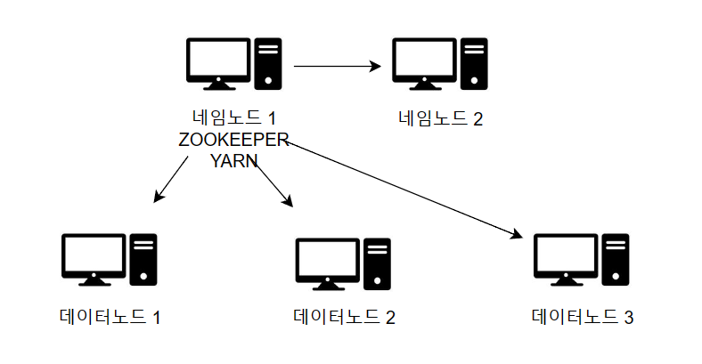
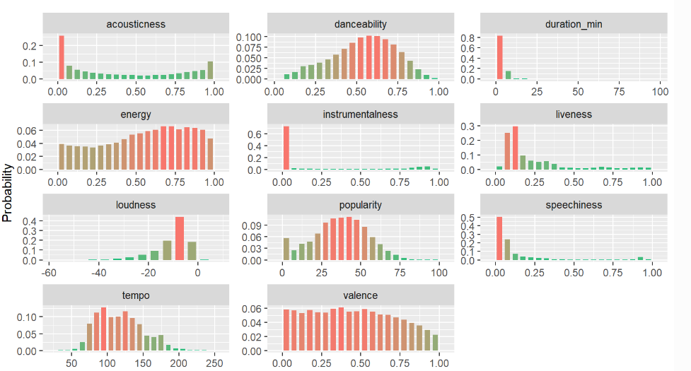

 

# 🎉 OnAIr

#### 별이 빛나는 밤에, 꿈꾸는 라디오, 푸른 밤, 두시의 데이트
##### 📻라디오를 들어보신적 있으신가요? 

###### 요즘에야 음악 들을 때 알고리즘을 통해 이노래 저노래를 자연스레 추천해주지만

###### 불과 십여년 전만 해도 라디오를 통해 음악을 추천받을 때가 꽤나 많았답니다.

##### 내 사연을 듣고 AI라디오가 추천해주는 음악을 많은 사람들과 공유해보세요!

###### OnAIr는 빅데이터 분산 처리 기반의 'AI 라디오' 프로젝트로 사용자가 '사연'과 '희망테마'를 입력하면 그에 맞는 대본과 음악 추천 결과를 생성하여 스트리밍 하는 서비스입니다.
 

# ⌛ 프로젝트 기간 : 2023. 08. 21 ~ 2023. 10. 06.

# 👥 팀 구성

<table align="center">
  <tr>
    <td align="center"><a href="https://github.com/hyunnn12"> <b>강현 Front-end </b></a></td>
    <td align="center"><a href="https://github.com/qkrrlgus114"> <b>박기현  Back-end </b></a></td>
    <td align="center"><a href="https://github.com/yeonchaking"> <b>연제경 PM/Full-Stack </b></a></td>
    <td align="center"><a href="https://github.com/Eungae-D"> <b>최규호  Front-end </b></a></td>
    <td align="center"><a href="https://github.com/pum005"> <b>최시환  Back-end </b></a></td>
    <td align="center"><a href="https://github.com/sixinchnails"> <b>최재용  Data-Engineer </b></a></td>
</table>

 

 

# 📌 주요 기능

## 1. 온캐스트 생성 및 재생
- 사용자가 제목, 사연을 입력 후 음악의 테마와 DJ를 설정.
- 음악 추천 알고리즘을 통해 사연에 맞는 음악 3가지 추천 및 TTS 생성.
- AI DJ가 사연을 읽고 그에 따른 추천된 음악을 재생.

## 2. 음악 플레이 리스트
- 원하는 음악을 내 보관함의 저장 후 나만의 플레이 리스트 생성.

## 3. 음악 플레이어
- 플레이 리스트를 재생하면 음악 플레이어 실행.
- 페이지가 바뀌어도 음악 플레이어는 끊김없이 재생.(사용성 강화)

## 4. 라이브 서버
- 공유된 온캐스트를 특정 시간에 라이브 서버에서 재생.(하루 10개 제한)
- 사용자들은 온캐스트를 들으며 소통.
- 마음에 드는 음악은 내 보관함에 추가 가능.

# 🔗 주요 기술

## 1. AWS EC2 5대의 서버로 Spark 클러스터 구축
- NameNode 1대, Backup NameNode 1대, DataNode 3대
- YARN과 ZOOKEEPER는 구동 중인 NameNode 상 운영
- 800만 개의 노래 데이터를 HDFS에 적재하여 분산 병렬 처리
- 클러스터 실행, 종료, 재실행 스크립트 작성
 

## 2. PCA와 K-평균 군집화를 활용한 음악 추천 기능
- 차원 축소법(PCA)으로 노래 데이터의 특성들의 다중공선성 제거 및 모델 성능 개선
- PySpark와 분산 병렬 처리를 이용한 800만 개의 노래 데이터를 K-평균 군집화
- 실루엣(Silhouette) 계수 기반으로 최적의 K 값 활용
- 사용자 입력 데이터가 속한 클러스터 내 중심점에 가까운 노래 목록 일부 추출
 

## 3. 사용자 사연 분석을 위해 BERT 기반의 트랜스포머 모델을 활용한 텍스트 감성 분석
- 추천 알고리즘에 필요한 Valence와 Energy를 얻기 위한 감성 분석 수행
- HuggingFace BERT 토크나이저 및 트랜스포머 모델(XLM-RoBERTa-large) 활용

## 4. 랜덤 포레스트로 음악 특성 값에 대한 특성 중요도를 도출하고 이를 코사인 유사도에 가중치로 적용하여 추천 결과 생성
- 앙상블 모델인 랜덤 포레스트(**sklearn.ensemble.RandomForestClassifier)**를 기반으로 각 노래 특성 별 중요도를 측정
- 전체 특성 중 일부를 제거하여 모델의 성능이 얼마나 변화하는가 기준으로 중요도 계산
- 특성 중요도는 클러스터마다 개별 측정
 

## 5. 데이터 수집기 구현 및 HDFS, YARN, ZOOKEEPER 서버 환경 구축
- Spotify API를 이용하여 키워드(ex. KPOP, ROCK etc.) 별 플레이리스트에 등록된 노래들과 특성 값들을 수집하여 HDFS에 적재
- YARN, ZOOKEEPER를 NameNode 서버 상에서 구동 및 관리

## 6. Flask, Hive와 Zeppelin을 활용한 추천 결과 집계 및 시각화
- Flask REST API 서버를 구축하여 사용자에게 추천 결과 제공
- Hive와 Zeppelin를 연동하여 MapReduce 기반 집계 및 시각화 수행
- Hive 메타스토어 DB로 Derby DB 사용

## 7. kafka를 통한, 실시간 라이브 서버간 비동기 메시지 통신 구현
- 라이브에 참여한 사용자에게 실시간 라이브 정보를 제공하는 서버와 라이브 스케줄을 관리하는 서버 사이에 실시간성을 높이기 위해 효율적인 데이터 전달 기술이 필요했습니다.
- kafka 와 zookeeper를 활용해 클러스터를 구축하여, 비동기 메시지 통신을 구현하고 안정적인 라이브 기능을 제공할수 있었습니다.

## 8. 불필요한 데이터 전송을 막기 위한 Websocket 도입
- 실시간 채팅과 실시간 라이브 방송을 진행을 위해, 사용자들이 서로 데이터를 주고 받아야만 했습니다.
- HTTP Polling 방식 대신, WebSocket 방식을 도입해 불필요한 데이터 전송을 줄여, 서버 부하를 막고, 네트워크 대역폭을 줄일수 있었습니다.

# 🔨 개발 및 협업 환경

### Backend
&nbsp;
&nbsp;
&nbsp;
&nbsp;
&nbsp;

### Frontend

&nbsp;
&nbsp;
&nbsp;
&nbsp;

### Data

&nbsp;&nbsp;&nbsp;&nbsp;&nbsp;&nbsp;

# 🖼 서비스 화면
### 온캐스트 생성을 위한 제목, 테마, 사연, DJ 선택

### 생성된 온캐스트의 라디오 컴포넌트

### 생성된 온캐스트의 음악 컴포넌트

### 저장된 온캐스트들 이 페이지에서 다시 재생 및 라이브로 공유 가능

### 음악 스트리밍까지 가능하여 원하는 플레이리스트들을 만들어 언제나 들을 수 있다.

### 음악 플레이어-플레이리스트들을 재생하는 페이지

### 라이브 페이지-공유된 온캐스트로 다 함께 실시간으로 감상 가능한 라디오

### 라이브 페이지-공유된 온캐스트의 음악들을 실시간으로 다함께 감상 가능

### 라이브 페이지-실시간으로 라이브 페이지에 있는 유저들끼리 소통 가능

# 💬 시스템 아키텍처

# 💬 데이터 모델링(ERD)

# 💬 화면 설계서(목업)

# 💬 인터페이스 설계서(API명세서)

